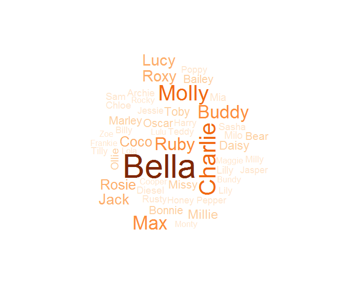

```{r setup, include=FALSE}
knitr::opts_chunk$set(echo = TRUE)
```

## Map!

The below map shows the most popular cat breed in each area:


```{r map1, warning=F,error=F,echo=F,message=F}
source("Code/data_manipulate.R")
cat_breed
```

The below map shows the most popular dog breed in each area:

```{r map2, warning=F,error=F,echo=F}
dog_breed
```

##So i'll get a staffy!! what have people named them?

The most popular name and breed combinations are:
```{r breedname, warning=F,error=F,echo=F,message=F}
library(data.table)
DT::datatable(Dogs_name_breed %>% select(-value))

```

##Gold lab or chocolate Lab??

There are `r gold` Golden Labs and `r choc` Chocolate Labs so you should probably get a Golden Lab. 

##What are the most popular names for dogs?



##What are the most popular names for cats?


##Where are all the Bellas??

```{r map3, warning=F,error=F,echo=F}
dog_name
```
